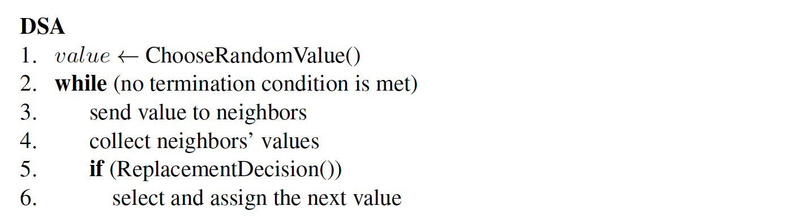
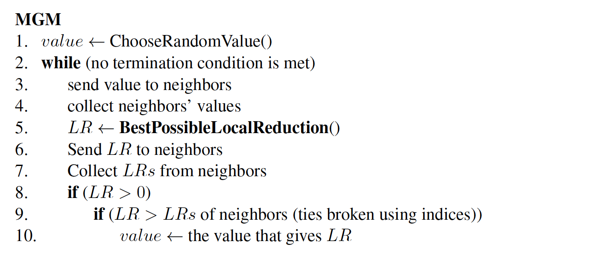

# Sync DCOP-MST Simulator (version 5)

## Models

### DCOP

Distributed Search.

### DCOP_MST

Distributed Search with Mobile Sensor Teams.

## Algorithms

### Standard DSA



### Standard MGM



### Algorithms For DCOP_MST

- Random
- DSA_MST
- CADSA
- DSSA
- Max-sum_MST
- Max-sum_MST with breakdowns
- CAMS

## Big Experiments

- 7 aforementioned algorithms
- 200 steps to each problem
- 20 problems per map per targets' type
- 4 maps: empy, random, warehouse, room
- 2 types of targets: static and dynamic
- 20 small iterations for CAMS
- 2 metrics: collision (col) metric and remained coverage requirement (rcr) metric

### Agents:
- number of agents is fixed for everything (in small maps - 20, in big maps - )
- SR of agents is fixed for everything
- MR of agents is fixed for everything
- Cred of agents is fixed for everything

### Targets:
- number of targets is fixed for everything  (in small maps - 10, in big maps - )
- Req of targets is fixed for static experiments

For one type of target and one map 
there is the following data structure:

```python
import numpy as np
# per type of targets per map: 
data_structure_for_json = { 
    'alg_name':  # (7 of them)
    np.zeros((200, 20))  # [[200(steps) x 20(problems) matrix]]
}
```

| map                                | Static Targets | Dynamic Targets |
|------------------------------------|----------------|-----------------|
| empty (empty-48-48)                |                |                 |
| random (random-32-32-10)           |                |                 |
| warehouse (warehouse-10-20-10-2-1) |                |                 |
| room (lt_gallowstemplar_n)         |                |                 |


## Credits

- [blog | Python – All possible pairs in List
](https://www.geeksforgeeks.org/python-all-possible-pairs-in-list/)